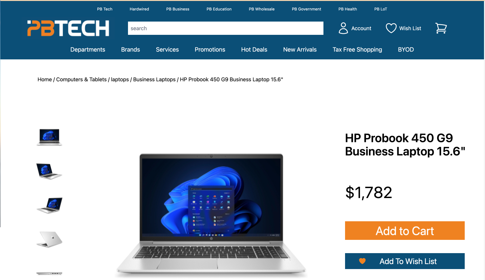
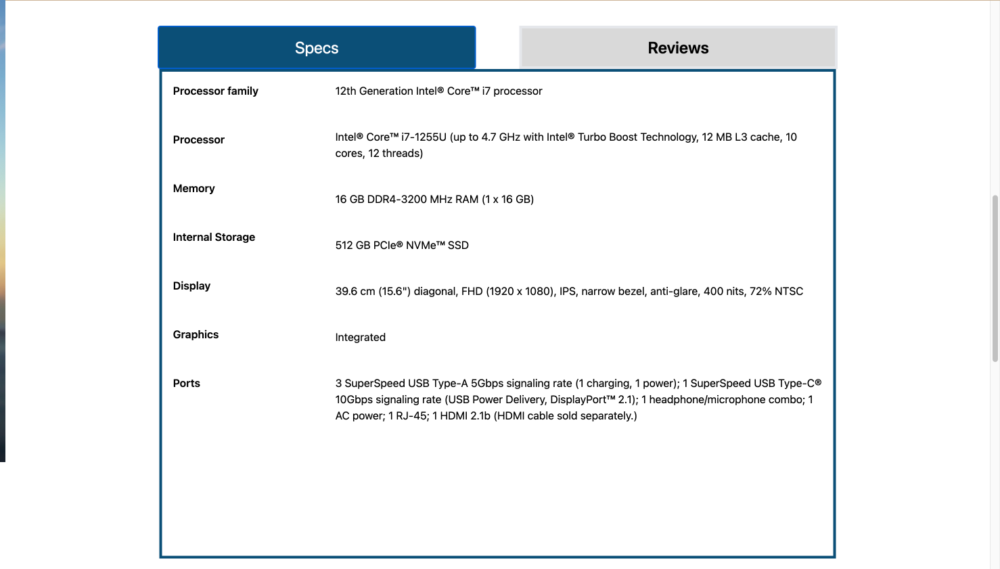
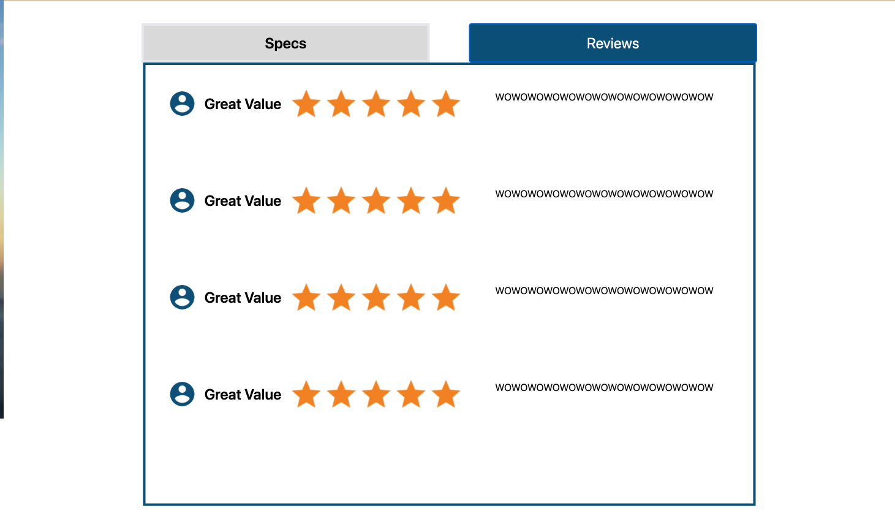
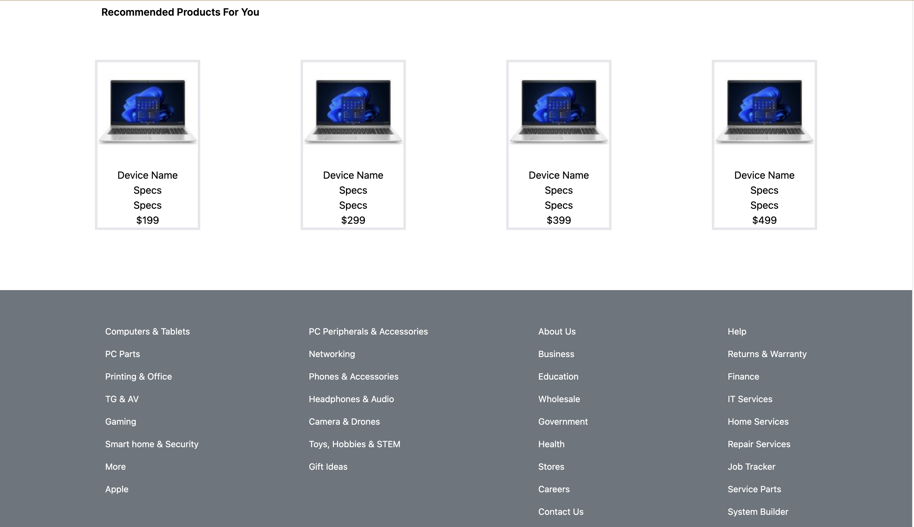

# PB Tech Website Redesign Project

## Introduction

This project was a collaboration with other UX designers at Mission Ready aimed at redesigning the PB Tech website to enhance user experience.

## About the Project

The primary goal of the project was to revamp the PB Tech website, taking user experience to the next level. We focused on improving the website's usability, accessibility, and overall visual appeal.

## Project Features

- Improved navigation and search functionality
- Responsive design for a seamless experience across devices

## Technologies Used

- Javascript
- React
- Tailwind CSS
- Node.js
- Express
- MongoDB
- Docker Compose


## Screenshots or Demo






## Project Structure

- `/frontend`: Contains the React frontend code.
- `/backend`: Includes the Node.js backend code. Also holds the MongoDB data.

### Prerequisites

- Node.js and npm installed on your machine.
- Docker and Docker Compose installed (for Dockerized deployment).

### Installation

To run the MERN stack project locally, follow these steps:

1. Clone the repository and navigate to the project's root directory.

2. Configure MongoDB Connection.

3. Run the backend server:
   ```bash
   cd backend
   node server.js

Run the frontend development server:
```bash
cd frontend
npm start

Access the app at `http://localhost:3000/product` in your web browser.

### Deployment 

To deploy the MERN stack project to a live environment using Docker Compose, follow these steps:

1. Clone the repository and navigate to the project's root directory.

2. Configure MongoDB Connection.

3. Create a docker-compose.yml file with the appropriate configurations.

4. Build and start the Docker containers:

bash
Copy code
docker-compose up

5. Access your app at `http://localhost:3000/product`in your web browser.

6. Connect the backend to MongoDB using the service name defined in the Docker Compose file.

## Contact

For any inquiries, you can reach me at audwns39@hotmail.com 